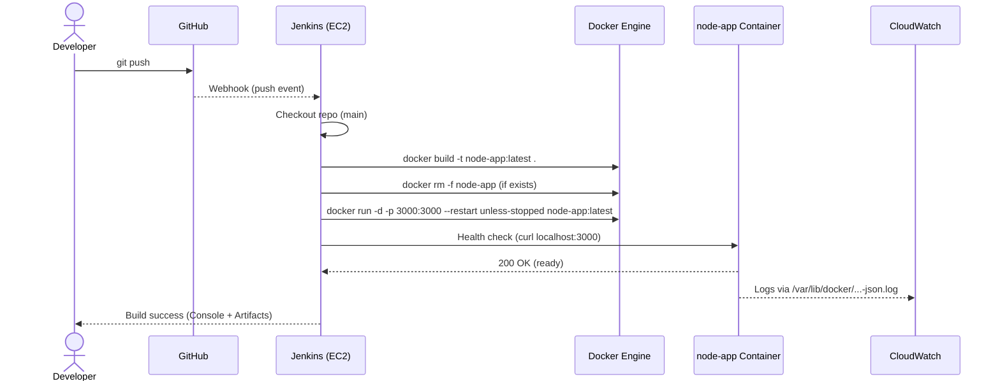

# DevOps Task – CI/CD on EC2 with Jenkins & Docker

A minimal, reproducible setup to build and deploy a Node.js app in Docker on an **EC2 (Ubuntu)** instance using **Jenkins LTS**. Includes port exposure, GitHub webhooks, and basic CloudWatch logging/metrics.

---

## 🏗️ Architecture

```mermaid
flowchart LR
  Dev[Developer\nPush commits] -->|Webhook| GH[GitHub Repo]
  GH -->|POST /github-webhook/| JX[Jenkins Controller (EC2)]
  subgraph EC2[EC2 Instance (Ubuntu)]
    JX -->|Checkout & Build| DK[Docker Engine]
    DK -->|Build image| IMG[Docker Image\nnode-app:latest]
    DK -->|Run container -p 3000:3000| APP[(node-app Container)]
    CW[CloudWatch Agent]\n(Logs + Metrics) -.-> CWL[CloudWatch Logs]
    CW -.-> CWM[CloudWatch Metrics\n(CWAgent)]
  end
  U[User / Browser] -->|HTTP :3000| APP
```

**Security Group (EC2):**

* Inbound: TCP 22 (SSH), TCP 8080 (Jenkins UI), TCP 3000 (App) — or map App to 80 instead.
* Outbound: allow HTTPS (for package installs, Docker pulls, GitHub webhooks).

---

## 🔧 Setup Instructions

### 0) Prerequisites

* EC2 Ubuntu 22.04+ with a public IP (or behind a load balancer), and an IAM role (for CloudWatch agent):

  * `CloudWatchAgentServerPolicy`
  * (Optional) `AmazonSSMManagedInstanceCore`
* Open Security Group ports as above.

---

### 1) Install Java 17, Docker, and utilities

```bash
# Update & tools
sudo apt-get update
sudo apt-get install -y curl gnupg ca-certificates jq

# Java 17 for Jenkins
sudo apt-get install -y openjdk-17-jre
java -version

# Docker (convenient path; for production prefer the official Docker repo)
sudo apt-get install -y docker.io
sudo systemctl enable --now docker

# Add jenkins user to docker group later (after Jenkins install)
```

---

### 2) Install Jenkins LTS (apt repository)

```bash
# Repo key (signed-by)
curl -fsSL https://pkg.jenkins.io/debian-stable/jenkins.io-2023.key \
  | sudo tee /usr/share/keyrings/jenkins-keyring.asc >/dev/null

# Repo entry
echo 'deb [signed-by=/usr/share/keyrings/jenkins-keyring.asc] https://pkg.jenkins.io/debian-stable binary/' \
  | sudo tee /etc/apt/sources.list.d/jenkins.list >/dev/null

sudo apt-get update
sudo apt-get install -y jenkins

# Start & enable
sudo systemctl enable --now jenkins
sudo systemctl status jenkins --no-pager -l

# First-time password
sudo cat /var/lib/jenkins/secrets/initialAdminPassword
```

Open **http\://<EC2-Public-IP>:8080** → paste the password → install suggested plugins.

> If port 8080 is busy, set `HTTP_PORT=8081` in `/etc/default/jenkins` and restart.

---

### 3) Allow Jenkins to use Docker

```bash
# Add jenkins user to the docker group
sudo usermod -aG docker jenkins
sudo systemctl restart docker
sudo systemctl restart jenkins

# Verify (optional)
sudo -u jenkins -H bash -lc 'docker info | head -20'
```

---

### 4) Configure the Jenkins Job (Freestyle)

1. **New Item → Freestyle project** (e.g., `DevOps-Task`).
2. **Source Code Management → Git**

   * Repository URL: `https://github.com/<you>/DevOps-Task.git` (or SSH if using keys)
   * Branches to build: `*/main`
3. **Build Triggers**

   * ✓ *GitHub hook trigger for GITScm polling* (set webhook in GitHub later)
4. **Build Steps → Execute shell** — paste this **/bin/sh-compatible** script:

```sh
set -eu

export DOCKER_BUILDKIT=1

echo "[Build] Building image..."
docker build -t node-app:latest .

# Remove old container if present
if docker ps -a --format '{{.Names}}' | grep -Eq '^node-app$'; then
  echo "[Deploy] Removing old container..."
  docker rm -f node-app
fi

# Run the container (host 3000 → container 3000)
echo "[Deploy] Starting container..."
docker run -d --name node-app --restart unless-stopped -p 3000:3000 node-app:latest

# Health check (up to ~20s)
i=0
while [ "$i" -lt 10 ]; do
  if curl -fsS http://localhost:3000 >/dev/null 2>&1; then
    echo "[Health] OK"
    exit 0
  fi
  i=$((i+1))
  echo "[Health] Waiting... ($i/10)"
  sleep 2
done

echo "[Health] FAILED"; docker logs --tail=200 node-app || true; exit 1
```

> If your job uses **/bin/bash**, you can replace the first line with `set -euxo pipefail`.

5. **Save** → **Build Now**.

---

### 5) GitHub Webhook

On your GitHub repo → **Settings → Webhooks → Add webhook**

* Payload URL: `http://<EC2-Public-IP>:8080/github-webhook/`
* Content type: `application/json`
* Events: *Just the push event* (or leave default)
* Save. Push a commit → Jenkins should start a build.

> If Jenkins is behind a firewall, expose it via an HTTPS endpoint or reverse proxy.

---

### 6) (Optional) CloudWatch Logging & Metrics on EC2 (Ubuntu)

**Install agent**

```bash
wget https://s3.amazonaws.com/amazoncloudwatch-agent/ubuntu/amd64/latest/amazon-cloudwatch-agent.deb
sudo dpkg -i -E ./amazon-cloudwatch-agent.deb
```

**Config file** → `/opt/aws/amazon-cloudwatch-agent/etc/amazon-cloudwatch-agent.json`

```json
{
  "agent": { "metrics_collection_interval": 60, "logfile": "/opt/aws/amazon-cloudwatch-agent/logs/amazon-cloudwatch-agent.log" },
  "metrics": {
    "append_dimensions": {"InstanceId": "${aws:InstanceId}", "InstanceType": "${aws:InstanceType}"},
    "metrics_collected": {
      "cpu": { "totalcpu": true, "measurement": ["cpu_usage_idle","cpu_usage_user","cpu_usage_system"] },
      "mem": { "measurement": ["mem_used_percent"] },
      "disk": { "resources": ["*"], "measurement": ["used_percent"], "ignore_file_system_types": ["sysfs","devtmpfs","proc","nsfs"] },
      "net": { "resources": ["*"], "measurement": ["bytes_in","bytes_out"] }
    }
  },
  "logs": {
    "logs_collected": {
      "files": { "collect_list": [
        { "file_path": "/var/log/syslog", "log_group_name": "/ec2/node-app", "log_stream_name": "{instance_id}/syslog", "retention_in_days": 14 },
        { "file_path": "/var/lib/docker/containers/*/*-json.log", "log_group_name": "/ec2/docker", "log_stream_name": "{instance_id}/{container_id}", "retention_in_days": 14 }
      ]}
    }
  }
}
```

**Start agent**

```bash
sudo /opt/aws/amazon-cloudwatch-agent/bin/amazon-cloudwatch-agent-ctl \
  -a fetch-config -m ec2 \
  -c file:/opt/aws/amazon-cloudwatch-agent/etc/amazon-cloudwatch-agent.json \
  -s
```

**View** in AWS Console:

* *CloudWatch → Logs → Log groups* → `/ec2/node-app`, `/ec2/docker`
* *CloudWatch → Metrics → CWAgent* → CPU, Memory, Disk, Net
* Query errors quickly (Logs Insights):

```sql
fields @timestamp, @logStream, @message
| filter @message like /ERROR|WARN/
| sort @timestamp desc
| limit 50
```

---

## ⚙️ Explanation of Pipeline Flow



**Stages (Freestyle script):**

1. **Build**: `docker build` with BuildKit; caches layers for faster builds.
2. **Replace**: `docker rm -f node-app` to avoid name conflicts.
3. **Run**: start fresh container mapping **host 3000 → container 3000** and set `--restart unless-stopped`.
4. **Health Check**: curl loop; fail fast if the app didn’t start (and print logs).
5. **Observe**: CloudWatch agent tails system & Docker logs; metrics go to `CWAgent`.

**Triggers:**

* Webhook on push (recommended) or `Poll SCM` schedule.

**Rollback:**

* `docker images | head` → pick previous image ID.
* `docker rm -f node-app && docker run -d --name node-app -p 3000:3000 <prev-image-id>`.

---

## 🔍 Troubleshooting

* **Container name already in use** → remove before run:

  ```bash
  docker rm -f node-app
  ```
* **Port already allocated** → pick another host port:

  ```bash
  docker run -d --name node-app -p 8000:3000 node-app:latest
  ```
* **Jenkins can’t use Docker** → add user to docker group & restart services.
* **EC2 not reachable** → open Security Group, check `curl http://localhost:3000` from the instance.
* **Low disk** → `docker system prune -af --volumes` and clean old workspaces.

---

## 📁 Project Structure (example)

```
DevOps-Task/
├─ Dockerfile
├─ package.json
├─ package-lock.json
├─ src/
│  └─ index.js
└─ README.md  ← this file
```

---

## ✅ Quick Start (manual)

```bash
# On EC2
git clone https://github.com/<you>/DevOps-Task.git && cd DevOps-Task
export DOCKER_BUILDKIT=1
sudo docker build -t node-app:latest .
sudo docker rm -f node-app 2>/dev/null || true
sudo docker run -d --name node-app -p 3000:3000 node-app:latest
curl -I http://localhost:3000
```

> Access from your browser: `http://<EC2-Public-IP>:3000`

---

**License:** MIT (or your choice)
